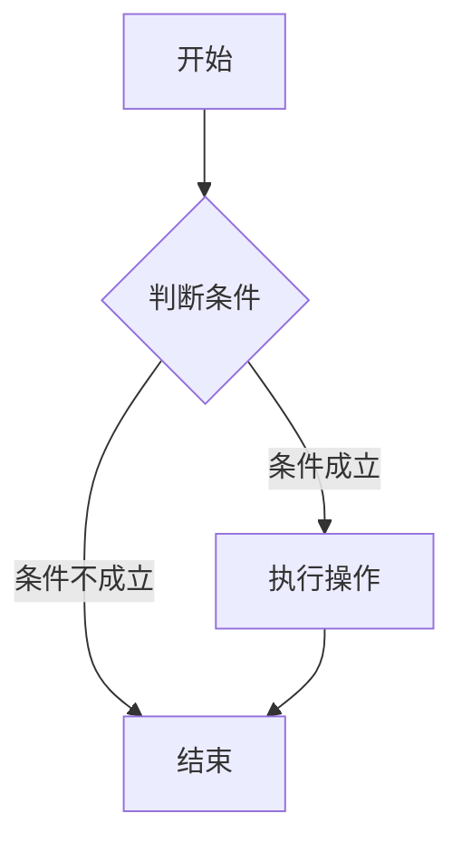
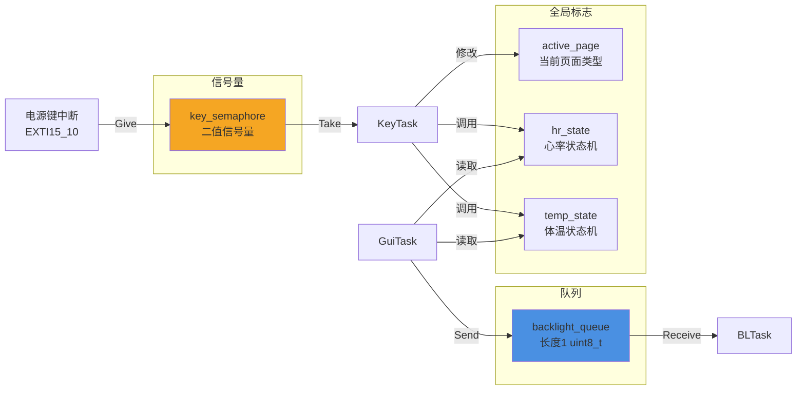
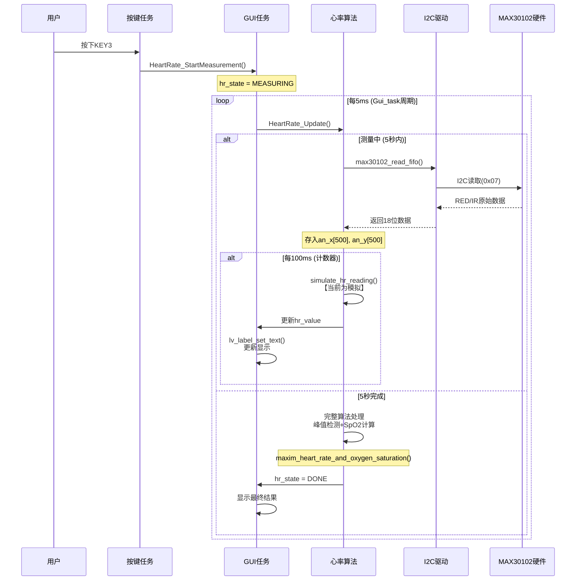
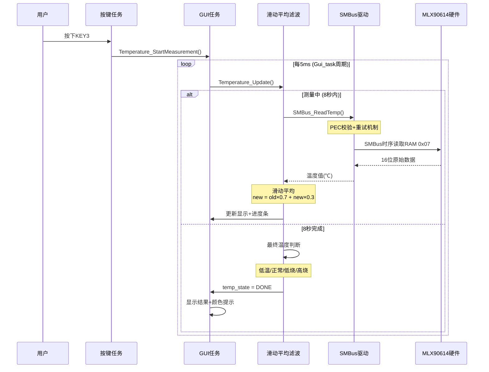
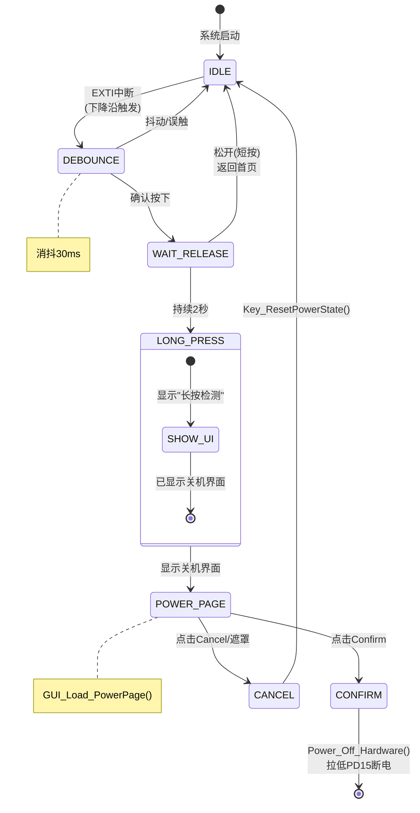
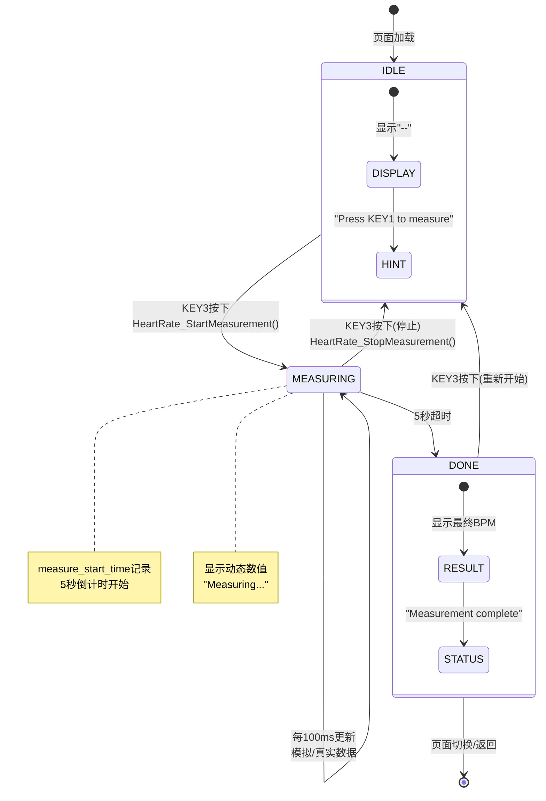

## 开发文档

#### 项目架构：

```mermaid
flowchart TD
    A[开始] --> B{判断条件}
    B -->|条件成立| C[执行操作]
    B -->|条件不成立| D[结束]
    C --> D
```

```mermaid
flowchart LR
    subgraph 信号量
        KEY_SEM[key_semaphore<br/>二值信号量]
    end
    
    subgraph 队列
        BL_Q[backlight_queue<br/>长度1 uint8_t]
    end
    
    subgraph 全局标志
        ACTIVE_PAGE[active_page<br/>当前页面类型]
        HR_STATE[hr_state<br/>心率状态机]
        TEMP_STATE[temp_state<br/>体温状态机]
    end
    
    EXTI[电源键中断<br/>EXTI15_10] -->|Give| KEY_SEM
    KEY_SEM -->|Take| KeyTask
    
    GuiTask -->|Send| BL_Q
    BL_Q -->|Receive| BLTask
    
    KeyTask -->|修改| ACTIVE_PAGE
    KeyTask -->|调用| HR_STATE
    KeyTask -->|调用| TEMP_STATE
    
    GuiTask -->|读取| HR_STATE
    GuiTask -->|读取| TEMP_STATE
    
    style KEY_SEM fill:#f5a623
    style BL_Q fill:#4a90e2
```

```mermaid
sequenceDiagram
    participant User as 用户
    participant Key as 按键任务
    participant GUI as GUI任务
    participant Algo as 心率算法
    participant I2C as I2C驱动
    participant MAX as MAX30102硬件
    
    User->>Key: 按下KEY3
    Key->>GUI: HeartRate_StartMeasurement()
    Note over GUI: hr_state = MEASURING
    
    loop 每5ms (Gui_task周期)
        GUI->>Algo: HeartRate_Update()
        alt 测量中 (5秒内)
            Algo->>I2C: max30102_read_fifo()
            I2C->>MAX: I2C读取(0x07)
            MAX-->>I2C: RED/IR原始数据
            I2C-->>Algo: 返回18位数据
            
            Note over Algo: 存入an_x[500], an_y[500]
            
            alt 每100ms (计数器)
                Algo->>Algo: simulate_hr_reading()<br/>【当前为模拟】
                Algo->>GUI: 更新hr_value
                GUI->>GUI: lv_label_set_text()<br/>更新显示
            end
        else 5秒完成
            Algo->>Algo: 完整算法处理<br/>峰值检测+SpO2计算
            Note over Algo: maxim_heart_rate_and_oxygen_saturation()
            Algo->>GUI: hr_state = DONE
            GUI->>GUI: 显示最终结果
        end
    end
```

```mermaid
sequenceDiagram
    participant User as 用户
    participant Key as 按键任务
    participant GUI as GUI任务
    participant Filter as 滑动平均滤波
    participant SMBus as SMBus驱动
    participant MLX as MLX90614硬件
    
    User->>Key: 按下KEY3
    Key->>GUI: Temperature_StartMeasurement()
    
    loop 每5ms (Gui_task周期)
        GUI->>Filter: Temperature_Update()
        alt 测量中 (8秒内)
            Filter->>SMBus: SMBus_ReadTemp()
            Note over SMBus: PEC校验+重试机制
            SMBus->>MLX: SMBus时序读取RAM 0x07
            MLX-->>SMBus: 16位原始数据
            SMBus-->>Filter: 温度值(℃)
            
            Note over Filter: 滑动平均<br/>new = old×0.7 + new×0.3
            
            Filter->>GUI: 更新显示+进度条
        else 8秒完成
            Filter->>Filter: 最终温度判断
            Note over Filter: 低温/正常/低烧/高烧
            Filter->>GUI: temp_state = DONE
            GUI->>GUI: 显示结果+颜色提示
        end
    end
```

```mermaid
stateDiagram-v2
    [*] --> IDLE: 系统启动
    
    IDLE --> DEBOUNCE: EXTI中断<br/>(下降沿触发)
    Note right of DEBOUNCE: 消抖30ms
    
    DEBOUNCE --> WAIT_RELEASE: 确认按下
    DEBOUNCE --> IDLE: 抖动/误触
    
    WAIT_RELEASE --> IDLE: 松开(短按)<br/>返回首页
    WAIT_RELEASE --> LONG_PRESS: 持续2秒
    
    LONG_PRESS --> POWER_PAGE: 显示关机界面
    Note right of POWER_PAGE: GUI_Load_PowerPage()
    
    POWER_PAGE --> CANCEL: 点击Cancel/遮罩
    POWER_PAGE --> CONFIRM: 点击Confirm
    
    CANCEL --> IDLE: Key_ResetPowerState()
    CONFIRM --> [*]: Power_Off_Hardware()<br/>拉低PD15断电
    
    state LONG_PRESS {
        [*] --> SHOW_UI: 显示"长按检测"
        SHOW_UI --> [*]: 已显示关机界面
    }
```

```mermaid
stateDiagram-v2
    [*] --> IDLE: 页面加载
    
    IDLE --> MEASURING: KEY3按下<br/>HeartRate_StartMeasurement()
    Note right of MEASURING: measure_start_time记录<br/>5秒倒计时开始
    
    MEASURING --> MEASURING: 每100ms更新<br/>模拟/真实数据
    Note right of MEASURING: 显示动态数值<br/>"Measuring..."
    
    MEASURING --> DONE: 5秒超时
    MEASURING --> IDLE: KEY3按下(停止)<br/>HeartRate_StopMeasurement()
    
    DONE --> IDLE: KEY3按下(重新开始)
    DONE --> [*]: 页面切换/返回
    
    state IDLE {
        [*] --> DISPLAY: 显示"--"
        DISPLAY --> HINT: "Press KEY1 to measure"
    }
    
    state DONE {
        [*] --> RESULT: 显示最终BPM
        RESULT --> STATUS: "Measurement complete"
    }
```

